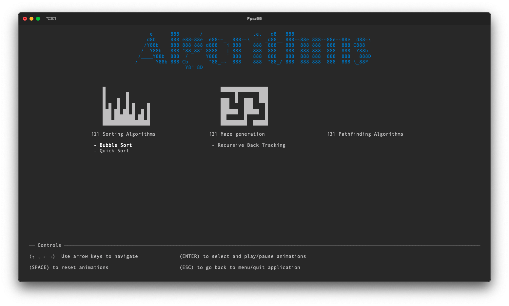
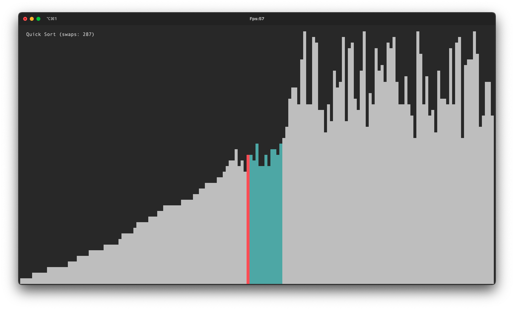
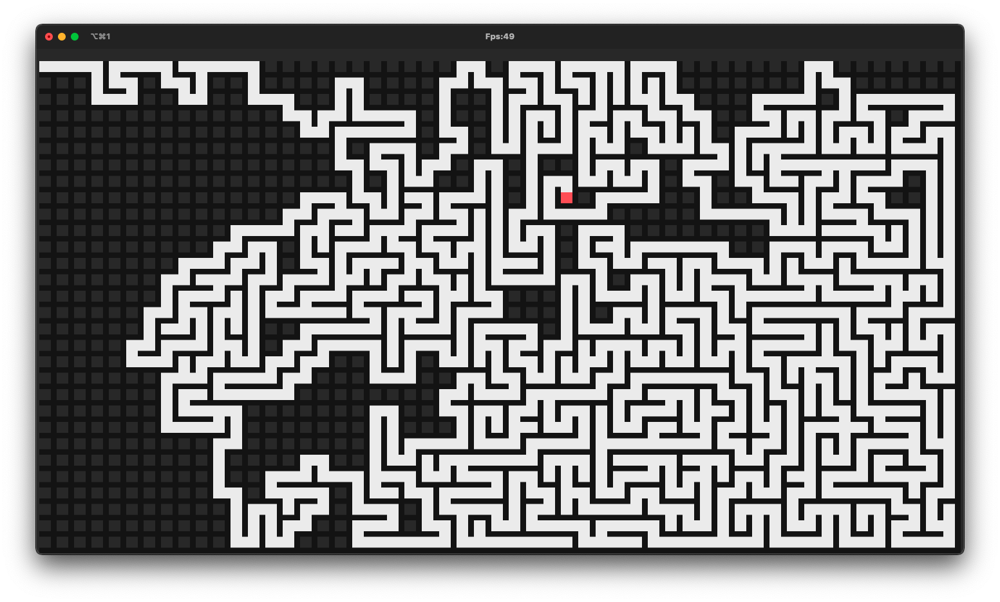
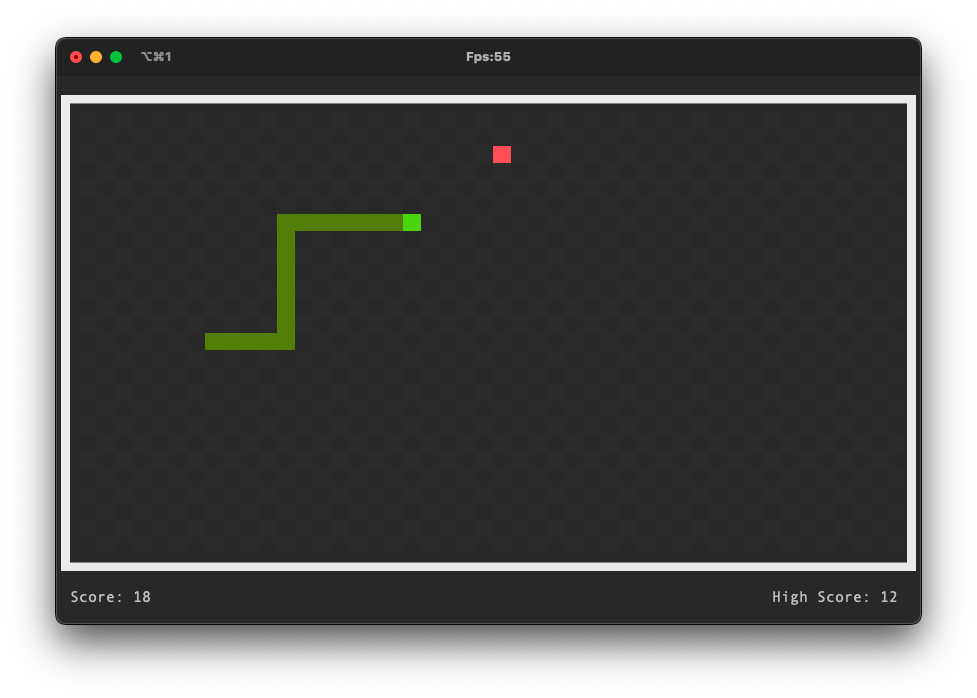

## Project work in progress... 
> **Current state:** early development, functional

## Contents

1. [Goal](#goal)
2. [Features](#features)
3. [Todo](#todo)
4. [Cells vs Pixels](#cells-vs-pixels)
5. [How to use (in current state)](#how-to-use)
6. [Demos](#demos)
7. [Contribution](#contribution)

## Goal
The main goal of this library is to create a easy and fun way to learn to code in Java. Concepts vary from package managment, to game structure, events and algorithms.

## Features
- Keyboard events
- Mouse hover events
- Mouse click events
- Sound
- Custom sized window
- Fullscreen mode
- Terminal state save and restore
- System.err logger
- Smart System.out.print()
- Custom colors for Cells
- Custom colors for Pixels
- And much more customisation...

## Todo
- [ ] create Youtube series step by step how-to
- [ ] add java doc
- [ ] simplify use
- [ ] add areas
- [ ] add sprites
- [ ] add simple geometric shapes  
- [ ] optimise performance  
...

## Cells vs Pixels
A Cell is the outerclass of a Pixel. It contains a x and y position on the Canvas, a Pixel instance and a priority (use for drawing).  
A Pixel contains a char, a background color and a forground color. Using half block chars, it allow to draw perfectly square pixels on the Canvas. ('▀' and '▄' instead of '█')

In order to draw anything, cells or pixel must be requested from Canvas.java

## How to use (in current state)
### Note
I am currently woking on this project, so no official JAR version is avaible for the moment.  
However, you can stay up to date by making this repo as starred and for the moment, you can download a JAR version from the [jTengineDemo](#demo) repo.

### Steps
1. Create new package in /application
2. Create new class overriding Application.java
3. Create new "states" package in this new package
4. Create new abstract class in "states" package overriding State.java
5. Create a class for each state of the application in "states" package overriding "YourApplicationState".java (abstract class)

#### This is an example of how the file tree would look like:
<pre>
.
└── 📦 src/
    └── 📦 "yourapplication"/
        ├── "YourApplication.java" ............ overrides Application.java
        └── 📦 states/
            ├── "YourApplicationState.java" ... overrides State.java
            └── "YourState.java" .............. overrides "YourApplicationState.java"
</pre>

6. Add a new instance of the Application in [Loop.java](src/com/leo/jtengine/Loop.java) main method

## Demos
Check out examples at [jTengineDemo](https://github.com/leonardcser/jtenginedemo) repo.

### Visualiser App

### Snake Game

## Contribution
Feel free to contact me: leocser632@gmail.com as well as suggesting ideas or features :)
